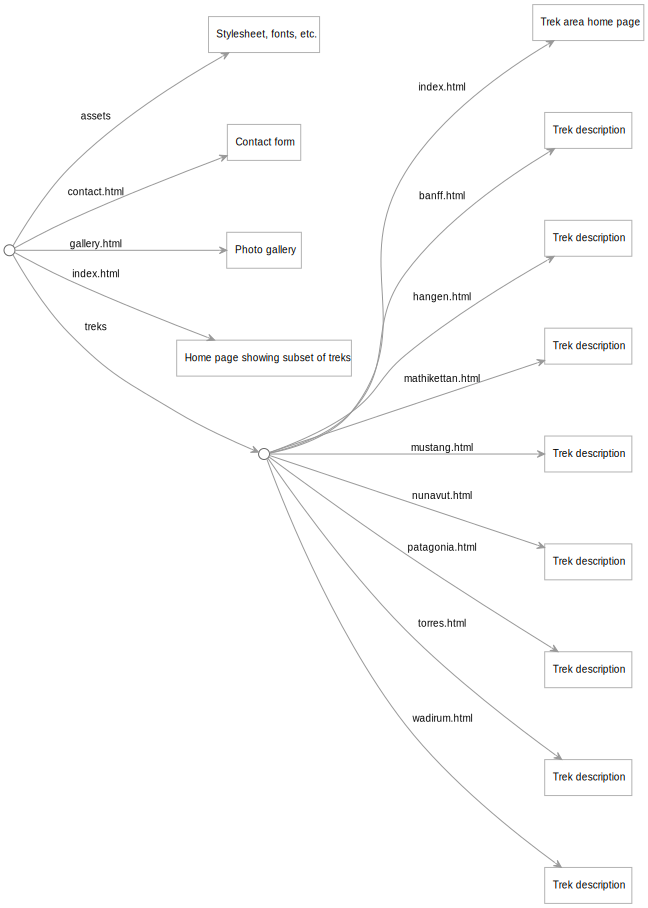

This is a sample site for an adventure trekking company written in the [Origami](https://weborigami.org) language.

[View site](https://aventour-expeditions.netlify.app/)

## Using Handlebars templates

This sample shows the use of a separate template language, [Handlebars](https://handlebarsjs.com/), in an Origami site.

Origami itself is a a powerful [template language](https://weborigami.org/language/templates), but if you're more comfortable with a different template language, it's possible to write a custom file handler so that Origami knows how to invoke templates in that language. This sample does that using an Origami extension that defines a [handler for Handlebars templates](https://github.com/WebOrigami/extensions/tree/main/handlebars).

## Structure of the site

The [site.ori](src/site.ori) file orchestrates the construction of the site:

- Trek descriptions in the `src/descriptions` folder include markdown with YAML front matter.
- The complete set of trek descriptions is used to generate the site's Treks area: one page for each trek, as well as an area home page showing the complete list.
- A subset of trek descriptions are fed to the index.hbs template so that it can show those as featured treks.
- The site's Gallery page wants to show all of the images in the `src/assets/images/trips` folder. The `site.ori` file gets the list of images in that folder, then hands it to a template to generate the Gallery page.

The site's visual style is based on the [Dolomia WordPress Theme](https://themeforest.net/item/dolomia-hiking-outdoor-mountain-guide-wordpress-theme/20086652) but completely rewritten to use more contemporary CSS.
